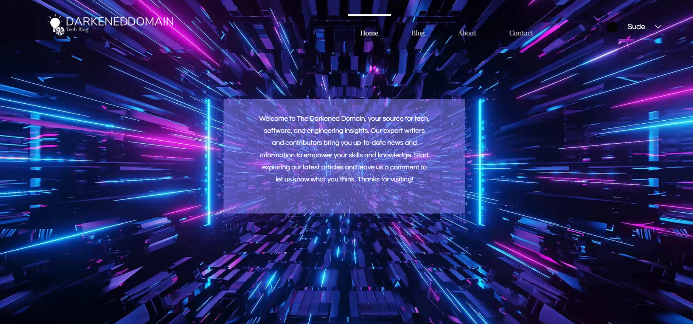

### Hi there, I'm Sude :blush: 

## Front-End Developer || Still a student ✨

### :envelope_with_arrow: Reach out to me 

[][twitter]

[][linkedin]
 
 
 
 

### :computer: Tech and Tools I use

  
 

  

 
 

 
 

## :bar_chart: Github Stats

  

## :chart_with_upwards_trend: Most Used Languages
  

## :desktop_computer: Visit my website
[Darkened Domain]  

[][Darkened Domain]
 
 

[twitter]: https://twitter.com/mSudegk
[linkedin]: https://www.linkedin.com/in/sude-g%C3%B6k-2189a9219/?locale=en_US
[Darkened Domain]: https://www.darkenedomain.com/
